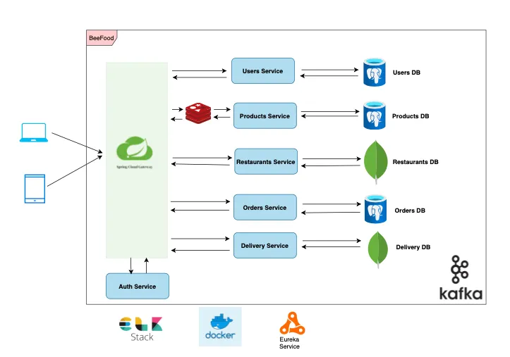

# 🍔 BeeFood – Microservices Food Ordering Platform

BeeFood is a **cloud-native food ordering and delivery platform** inspired by ShopeeFood, built using **Spring Boot microservices architecture**.
The system is designed for **high scalability, fault tolerance, and real-time processing**, supporting thousands of concurrent users and orders.

---

## 📌 Project Objectives

* Build a **real-world microservices system** following industry best practices
* Demonstrate **service isolation**, **event-driven communication**, and **cloud-native design**
* Support **real-time order processing and delivery tracking**
* Provide **centralized logging, monitoring, and observability**

---

## 🚀 Quick Start with Docker

**Get the entire platform running in 3 commands:**

```bash
# 1. Build all services
./scripts/build-all.sh

# 2. Start everything (infrastructure + all microservices)
docker-compose up -d

# 3. Verify services are running
docker-compose ps
```

**Access the platform:**
- **API Gateway**: http://localhost:8080
- **Eureka Dashboard**: http://localhost:8761
- **All services** are automatically registered and load-balanced

📖 **Detailed guide**: See [DOCKER_QUICKSTART.md](DOCKER_QUICKSTART.md)

---

## 🧩 High-Level Architecture


### Architectural Style

* **Microservices Architecture**
* **Event-Driven Architecture (EDA)** using Kafka
* **API Gateway Pattern**
* **Database-per-Service Pattern**

### System Diagram

> Each microservice owns its **own database**, ensuring loose coupling and independent scalability.

**Client (Web / Mobile)**
→ **Spring Cloud Gateway**
→ **Microservices (Users, Products, Restaurants, Orders, Delivery)**
→ **Databases (PostgreSQL / MongoDB)**
→ **Kafka / Redis / ELK**

---

## ⚙️ Core Components

### 1️⃣ Spring Cloud Gateway

* Single entry point for all client requests
* Handles:

  * Request routing
  * JWT authentication
  * Rate limiting
  * Load balancing
* Prevents direct access to internal services

---

### 2️⃣ Auth Service

* User authentication & authorization
* Responsibilities:

  * Register / login users
  * Issue and validate JWT tokens
* Integrated with **Spring Security**

---

### 3️⃣ Users Service

* Manages all user-related data:

  * Customers
  * Restaurant owners
  * Delivery drivers
* Stores:

  * Profile information
  * Roles and permissions
* **Database:** PostgreSQL

---

### 4️⃣ Products Service

* Manages food & beverage items
* Responsibilities:

  * Product listings
  * Pricing
  * Inventory management
* **Redis cache** used for:

  * Popular products
  * Menus
* **Database:** PostgreSQL

---

### 5️⃣ Restaurants Service

* Manages restaurant data:

  * Restaurant profiles
  * Menus
  * Operating hours
* Uses **MongoDB** for flexible schema design
* Optimized for frequent updates to menus

---

### 6️⃣ Orders Service

* Core business service of the system
* Responsibilities:

  * Order creation
  * Payment processing
  * Order status tracking
* Publishes domain events to **Kafka**
* **Database:** PostgreSQL

---

### 7️⃣ Delivery Service

* Handles logistics & delivery workflow
* Responsibilities:

  * Assign delivery drivers
  * Track delivery status in real-time
* Consumes Kafka events from Orders Service
* **Database:** MongoDB

---

## 📡 Event-Driven Communication (Kafka)

### Why Kafka?

* Decouples services
* Improves scalability
* Ensures reliable asynchronous communication

### Example Flow

1. `Orders Service` publishes `ORDER_CREATED`
2. `Delivery Service` consumes the event
3. Delivery task is created automatically
4. System remains resilient even if one service is temporarily down

### Sample Kafka Event

```json
{
  "eventType": "ORDER_CREATED",
  "orderId": "ORD12345",
  "userId": "USR67890",
  "restaurantId": "REST111",
  "products": [
    { "productId": "PROD001", "quantity": 2 }
  ],
  "total": 150000,
  "status": "PENDING",
  "createdAt": "2025-10-29T07:12:00Z"
}
```

---

## 🚀 Caching Strategy (Redis)

* Used mainly by **Products Service**
* Reduces database load
* Improves response time for:

  * Product lists
  * Menus
  * Frequently accessed data

---

## 📊 Logging & Monitoring (ELK Stack)

| Component     | Role                         |
| ------------- | ---------------------------- |
| Elasticsearch | Stores logs and metrics      |
| Logstash      | Collects & processes logs    |
| Kibana        | Visualizes logs & dashboards |

**Benefits**

* Centralized logging
* Faster debugging
* Performance analysis
* System health monitoring

---

## 🗃️ Database Design

| Service     | Database   | Main Tables / Collections     |
| ----------- | ---------- | ----------------------------- |
| Users       | PostgreSQL | users, roles                  |
| Products    | PostgreSQL | products, categories          |
| Restaurants | MongoDB    | restaurants, menus            |
| Orders      | PostgreSQL | orders, order_items, payments |
| Delivery    | MongoDB    | deliveries, drivers           |

---

## 🔄 Order Processing Workflow

1. User places order via **Client**
2. Request goes through **API Gateway**
3. **Orders Service**:

   * Validates request
   * Saves order to DB
4. Order event published to **Kafka**
5. **Delivery Service** assigns driver
6. **Products Service** updates inventory
7. All actions logged to **ELK**

---

## 🧰 Technology Stack

| Category         | Technology                     |
| ---------------- | ------------------------------ |
| Backend          | Spring Boot, Spring Cloud      |
| Security         | Spring Security, JWT           |
| Databases        | PostgreSQL, MongoDB            |
| Messaging        | Apache Kafka                   |
| Cache            | Redis                          |
| Logging          | ELK Stack                      |
| Containerization | Docker, Docker Compose         |
| Build Tool       | Maven / Gradle                 |
| Deployment       | Docker / Kubernetes (optional) |

---

## 🐳 Deployment (Docker Compose)

```yaml
version: "3.9"
services:
  gateway:
    image: spring-gateway:latest
    ports:
      - "8080:8080"

  users-service:
    image: users-service:latest

  orders-service:
    image: orders-service:latest

  postgres:
    image: postgres:14

  kafka:
    image: bitnami/kafka:latest

  redis:
    image: redis:latest

  elasticsearch:
    image: docker.elastic.co/elasticsearch/elasticsearch:8.10.2

  kibana:
    image: docker.elastic.co/kibana/kibana:8.10.2
    ports:
      - "5601:5601"
```

---

## 🎯 Key Benefits of This Architecture

* ✅ High scalability
* ✅ Fault isolation
* ✅ Independent deployments
* ✅ Real-time processing
* ✅ Production-ready design

---

## 📚 Documentation

This project includes comprehensive documentation:

| Document | Description | Use When |
|----------|-------------|----------|
| **[DOCKER_QUICKSTART.md](DOCKER_QUICKSTART.md)** | Quick start guide for Docker | You want to run the platform immediately |
| **[ARCHITECTURE.md](ARCHITECTURE.md)** | Complete architecture & Docker guide | You need to understand system design and Docker patterns |
| **[Instruction.md](Instruction.md)** | Detailed installation & configuration | You want to customize setup or troubleshoot |
| **[.github/copilot-instructions.md](.github/copilot-instructions.md)** | AI coding agent guidelines | You're developing or contributing code |

### Quick Navigation

**Getting Started:**
1. **New to the project?** → Start with [DOCKER_QUICKSTART.md](DOCKER_QUICKSTART.md)
2. **Want to understand architecture?** → Read [ARCHITECTURE.md](ARCHITECTURE.md)
3. **Need detailed setup?** → Follow [Instruction.md](Instruction.md)
4. **Ready to code?** → Check [.github/copilot-instructions.md](.github/copilot-instructions.md)

---

## 🐳 Docker Architecture

### What's Included

The `docker-compose.yml` orchestrates:

**Infrastructure Layer:**
- PostgreSQL (3 databases for Users, Products, Orders)
- MongoDB (2 databases for Restaurants, Delivery)
- Redis (cache layer)
- Kafka + Zookeeper (event streaming)

**Service Layer:**
- Eureka Server (service discovery)
- API Gateway (single entry point)
- 6 Microservices (Users, Products, Restaurants, Orders, Delivery, Notification)

### Key Features

- ✅ **One-command startup**: `docker-compose up -d`
- ✅ **Health checks**: Services wait for dependencies
- ✅ **Service discovery**: Automatic registration with Eureka
- ✅ **Persistent storage**: Data survives restarts
- ✅ **Network isolation**: All services in private network
- ✅ **Easy scaling**: `docker-compose up -d --scale order-service=3`

### Usage

```bash
# Start everything
docker-compose up -d

# View logs
docker-compose logs -f

# Stop everything
docker-compose down

# Clean restart (removes data)
docker-compose down -v && docker-compose up -d
```

For detailed Docker usage, see [ARCHITECTURE.md](ARCHITECTURE.md#-docker-architecture).

---

## 📌 Future Enhancements

* Kubernetes deployment (HPA, autoscaling)
* Circuit breaker (Resilience4j)
* Distributed tracing (Zipkin / Jaeger)
* Real-time WebSocket tracking
* Recommendation engine (ML-based)
* API documentation (Swagger/OpenAPI)
* Centralized logging (ELK Stack)
* Monitoring dashboard (Prometheus + Grafana)

---

## 👨‍💻 Author

**BeeFood – Microservices Food Ordering System**
Designed & implemented for learning and real-world system architecture practice.

---

## 🤝 Contributing

Contributions are welcome! Please:

1. Read [.github/copilot-instructions.md](.github/copilot-instructions.md) for architecture rules
2. Follow the existing code patterns
3. Respect service boundaries (no cross-database access!)
4. Write tests for new features
5. Update documentation

---

## 📝 License

This project is created for educational purposes.

---

⭐ *If you are reviewing this project: focus on service boundaries, Kafka integration, Docker orchestration, and data isolation – these are the core strengths of BeeFood.*

